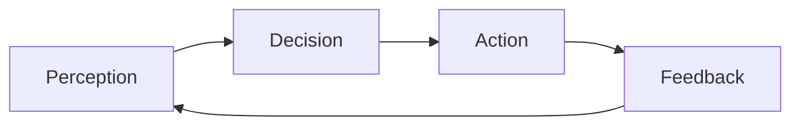
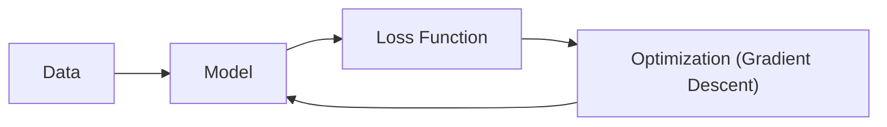
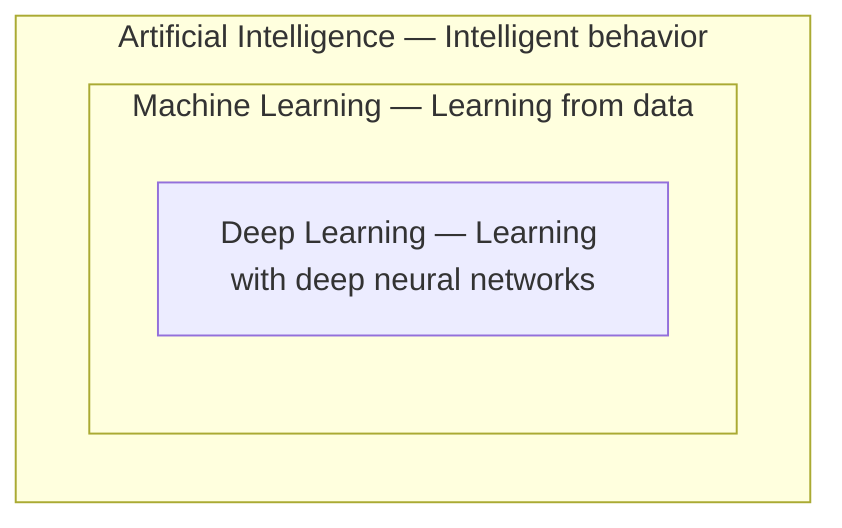

[Artificial Neural Networks](../../index.md) → Week 1: Introduction to Neural Networks → Lesson 1: Evolution of AI, ML and Deep Learning

---

# Evolution of AI, ML and Deep Learning

## Summary
This lecture traces how Artificial Intelligence evolved from hand-coded, rule-based
systems into today's data-driven approach, and how Machine Learning and Deep Learning
sit inside AI as increasingly specialized ways of achieving it. It covers the core
components of a Machine Learning system, the limitations that motivated Deep Learning,
and the capabilities deep neural networks add on top of classical ML. It then explains
why deep neural networks — despite existing for decades — have only recently become
state-of-the-art, driven by four pillars: data, compute, optimisation and architecture.

## Key Concepts

### 1. AI, ML and Deep Learning

#### What is Artificial Intelligence
- AI = goal-driven intelligent systems: a system that perceives its environment, makes
  decisions, and takes actions to maximize a defined objective.
- Runs as a continuous core loop, not a one-off calculation:

- Common applications: autonomous driving, recommendation systems, fraud detection.

#### Two paradigms of AI
- Historically AI has been built two different ways — modern AI has shifted decisively
  toward the data-driven paradigm.

| | Symbolic AI | Data-driven AI |
|---|---|---|
| How it works | Logic and rules | Statistics and optimization |
| Knowledge source | Encoded manually by humans | Learned from data |
| Modern relevance | Earlier approach | Basis of modern AI |

#### Machine Learning
- Machine Learning = data-driven AI: the machine learns a function `f(x, θ)` from data,
  where `x` is the input data and `θ` are the model's parameters.
- Four key components work together as a pipeline:

##### Limitations of classical Machine Learning
- Features are hand-engineered rather than learned — a human decides what inputs to
  extract from raw data.
- The model only learns parameters, not representations — it can't discover its own
  way of representing the data.

#### Deep Learning
- Deep Learning = Machine Learning with deep neural networks: networks built from
  multiple layers.
- Unlike classical ML, features, representations, and parameters are all learnt
  jointly by the network rather than engineered by hand.
- Neural networks add capabilities classical ML doesn't have:
    - Automatic feature learning
    - High-dimensional representation learning
    - End-to-end differentiable optimization
    - Large-scale optimization with millions of parameters

#### Relationship between AI, ML and DL
- Each is nested inside the one before it — DL is a subset of ML, which is a subset
  of AI.

---

### 2. Why Deep Learning Works Today

#### Neural networks existed for decades, but only recently became state-of-the-art
- Their success today rests on four pillars: Data, Compute, Optimisation, and
  Architecture.

#### Data & compute make scale possible
- Modern models train on massive datasets — billions of images, billions of text
  samples, trillions of user interactions.
- Training cost scales as `O(n·p)`, where `n` = number of samples and `p` = number of
  parameters.
- Modern compute (GPU/TPU) provides fast parallel processing and efficient
  optimisation, making training at this scale practical.

#### Optimisation
- Deep learning has historically suffered from vanishing and exploding gradients,
  which made deep networks hard to train.
- These are largely solved today, enabling reliable training of much deeper networks.

#### Architecture
- One of the four pillars behind deep learning's current success, alongside Data,
  Compute, and Optimisation.

## Worked Examples
This was a conceptual overview lecture — no worked numerical examples were presented.

## Glossary
| Term | Definition |
|------|------------|
| Artificial Intelligence (AI) | A goal-driven intelligent system that perceives its environment, decides, and acts to maximize a defined objective |
| Symbolic AI | AI built on manually encoded logic and rules |
| Data-driven AI | AI that learns behavior from data using statistics and optimization, rather than hand-coded rules |
| Machine Learning (ML) | Data-driven AI that learns a function `f(x, θ)` from data |
| Loss function | A measure of how far the model's predictions are from the desired output, used to guide learning |
| Gradient descent | The optimization method used to adjust model parameters to reduce the loss |
| Feature engineering | Manually deciding which inputs/features a classical ML model should learn from |
| Representation learning | A model learning its own useful way of representing raw data, rather than relying on hand-engineered features |
| Deep Learning (DL) | Machine Learning using deep (multi-layer) neural networks that jointly learn features, representations, and parameters |
| Vanishing/exploding gradients | A training problem in deep networks where gradients shrink toward zero or grow uncontrollably as they propagate through layers, making the network hard to train |
| Training cost `O(n·p)` | Training cost scales with the number of samples (`n`) times the number of parameters (`p`) |
