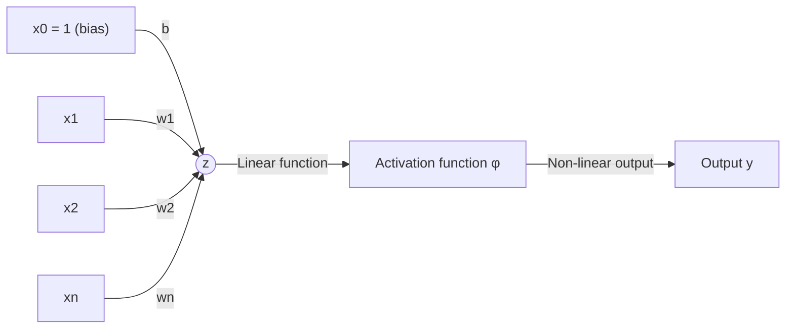
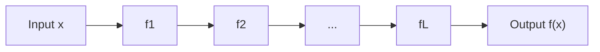

[Artificial Neural Networks](../../index.md) → Week 1: Introduction to Neural Networks → Lesson 2: Biological Neurons vs Artificial Neurons

---

# Biological Neurons vs Artificial Neurons

## Key Concepts

### 1. Biological Neurons vs Artificial Neurons

#### Biological neuron
- Works by signal aggregation followed by firing: dendrites collect input signals, the
  soma aggregates them, and the neuron fires along the axon if the aggregated signal
  is strong enough.

#### How biology is abstracted in ANNs
Each part of a biological neuron maps to a specific piece of the artificial neuron.

| Biological Neuron | Artificial Neuron |
|---|---|
| Dendrites — input features `x1, x2, ..., xn` | Inputs |
| Soma — weighted summation | Linear function (`z = Σwᵢxᵢ + b`) |
| Firing | Activation function (`φ`) |
| Axon | Output (`y`) |

#### The artificial neuron
- A neuron is a **parametric nonlinear function**: it first combines inputs linearly,
  then applies a non-linear function to the result.

- **Linear combination:** `z = Σᵢ₌₁ⁿ wᵢxᵢ + b`
- **Non-linear output:** `y = φ(z)`
- Where: `xᵢ` = inputs, `wᵢ` = weights, `b` = bias, `φ(.)` = activation function.

#### Why simple artificial neurons are sufficient
- A single artificial neuron is a weak learner on its own.
- Its power comes from three things working together:
    - A large number of neurons
    - Layered composition
    - End-to-end optimisation using data
- This layered composition gives the deep network form:

- `f(x) = f_L(f_{L-1}(...f_1(x)))`
- Overall, deep learning combines: inspiration from biology + performance from
  mathematics + optimisation.

---

### 2. The Neuron as a Simple Feature Detector

#### What a single neuron actually does
- A single artificial neuron performs weighted aggregation, which lets it detect a
  pattern in its input — it isn't a decision-maker on its own.
- The neuron's weights are what define which pattern it detects.
- A single neuron can only detect simple patterns; real intelligence emerges from many
  neurons organised in multiple layers.

#### Analogy *(not from the recorded lecture — added for intuition)*
- **A single neuron** = one voter with a very narrow opinion. They only care about one
  specific question (e.g. "is there a vertical edge in the top-left corner?"), weigh
  how much each piece of evidence (input) matters to *their* question, and cast a
  single yes/no-ish signal. They can't tell you "this is a cat" — only whether their
  one narrow pattern showed up.
- **A layer** = a committee of such voters, each specializing in a different narrow
  question, all looking at the same input in parallel.
- **The network (many layers)** = committees stacked on committees — one committee's
  votes become the input evidence for the next committee, which asks more complex
  questions, until the final layer can answer the real question (e.g. "is this a
  cat?").
