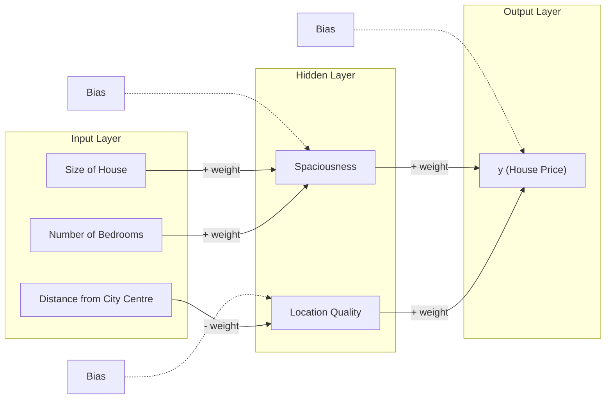
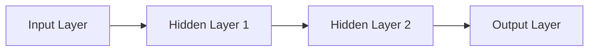
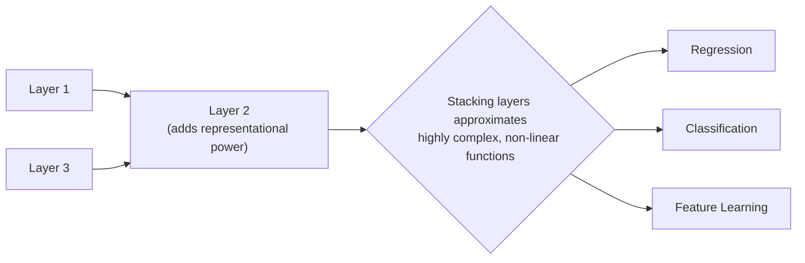
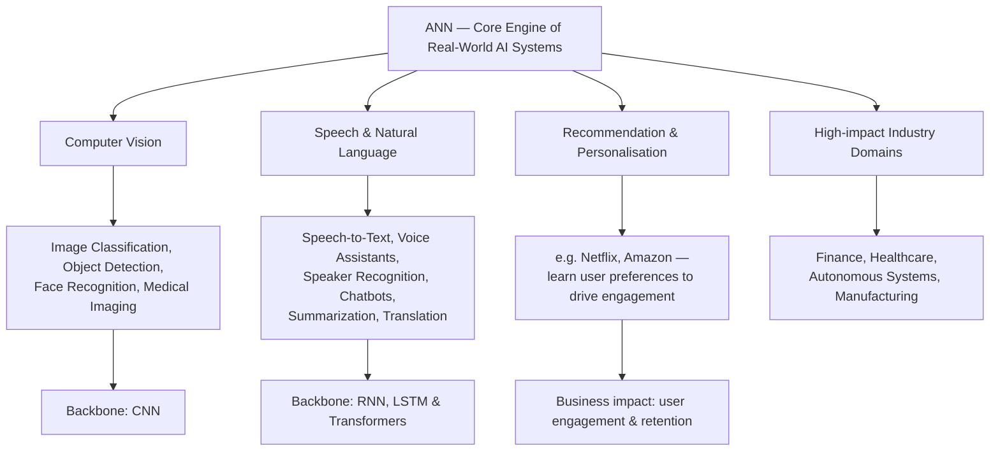
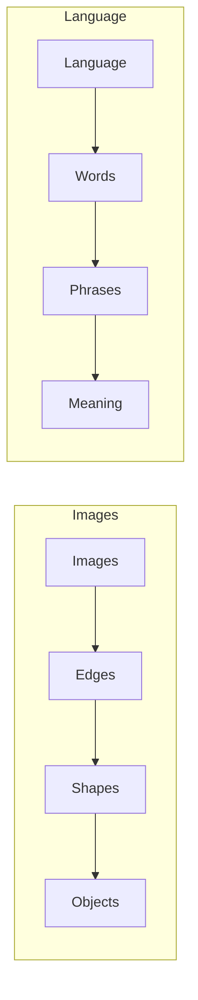

[Artificial Neural Networks](../../index.md) → Week 1: Introduction to Neural Networks → Lesson 3: Components and Feed-forward Networks

---

# Components and Feed-forward Networks

## Key Concepts

### 1. Weights, Bias and Layers

#### Weights
- Represent how important a feature is to the neuron receiving it
- A positive weight means the feature pushes the output up; a negative weight means it pulls the output down
- Learned during training, so the network gradually learns which features matter and by how much

#### Bias
- A baseline value added to a neuron's weighted sum, independent of any input
- It's the value the neuron would output if every input feature were zero — a floor the weighted inputs then adjust up or down
- Lets the network shift its output even when the inputs alone wouldn't produce the right value

#### Layers
- A network processes inputs through a sequence of layers: input layer → hidden layer(s) → output layer
- Each layer takes the previous layer's output as its own input, combining simpler features into more abstract ones as data moves forward
- Example: predicting house price from size, number of bedrooms, and distance from the city centre

- Size of the house and number of bedrooms both carry positive weights, so they combine into a hidden "spaciousness" feature
- Distance from the city centre carries a negative weight, since being farther out reduces "location quality"
- The hidden layer's spaciousness and location quality then combine in the final layer to produce the output, y

#### How Weights, Bias and Layers Relate
- Layers give the network its structure — the sequence of computations from input to output
- Every neuron in every layer performs the same basic step: combine its inputs using weights, add its own bias, and pass the result on
- Weights and biases are the network's learnable parameters — they're what training actually adjusts; the layers are the fixed structure those parameters operate within
- So a neural network is really just layers of neurons, each transforming its inputs the same way (weighted sum + bias), stacked so the output of one becomes the input to the next

---

### 2. Feed-forward Networks

#### One-directional Data Flow
- Data always flows one way: input layer → hidden layer(s) → output layer
- No neuron ever sends its output backward to an earlier layer

#### Why "Feed-forward" — the DAG Structure
- The network's connections form a Directed Acyclic Graph (DAG) — no cyclic dependencies between neurons
- A neuron never depends on a past output or a future input to compute its result
- This keeps forward computation (and training) simple and efficient, since each neuron's value can be computed once, in a fixed order, from front to back

#### Expressive Power of Feed-forward Networks
- Stacking layers lets the network approximate highly complex, non-linear functions, even when each individual neuron is simple
- Each additional layer adds representational power — deep compositions of simple neurons can model rich patterns
- This expressive power is why feed-forward networks are used for regression, classification, and feature learning

---

### 3. Where ANN is Used

#### Real-world Application Domains
- ANNs are the core engines behind real-world AI systems, spanning several major domains

#### Why Neural Networks are Preferred
- Learn directly from raw data — no need to hand-craft features first
- Scale with data — performance keeps improving as more data becomes available
- End-to-end optimisation — every layer's parameters are trained together toward the final task

---

### 4. Current Limitations & Motivations for Deeper Models

#### Expressive Limits of Shallow Networks
- Networks with very few layers — or just one hidden layer — can only model limited types of patterns
- Many real-world relationships are highly non-linear and hierarchical
- Complex problems need multiple levels of transformation; shallow networks mostly see flat data, with no depth to build those levels up

#### Reliance on Hand-Engineered Features
- Earlier ML systems required manual feature design — a human decided what the useful inputs were
- Shallow networks still struggle when raw data is very high-dimensional and the useful features are deeply hidden inside it
- Performance then becomes limited by the quality of human-designed features, not by the network's own learning capability

#### Cannot Capture Hierarchical Structure
- Real-world data is naturally hierarchical, built up from simple pieces into complex ones

- Without enough layers to build up these intermediate stages, a shallow network can't represent this kind of hierarchy

#### Why Do We Need Deeper Models?
- Depth allows reuse of intermediate features, and composition of simple functions into more complex ones
- Deeper models are more parameter-efficient for complex tasks, and learn better abstract representations
- This motivates the move to multi-layer and deep neural networks

#### Shallow vs Deep Networks

| | Shallow Networks | Deeper Networks |
|---|---|---|
| Good for | Simple patterns | Complex, real-world intelligence |
| Addresses | Insufficient for complex, real-world intelligence | Representation limits, feature bottlenecks, hierarchical structure |
