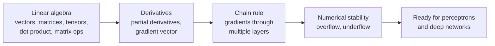

[Artificial Neural Networks](../../index.md) → Week 2: Mathematical Foundations for Neural Networks → Lesson 1: Why We Need Mathematical Foundations

---

# Why We Need Mathematical Foundations

## Key Concepts

### From concepts to mathematics
- Week 1 covered the concepts: neurons, layers, feed-forward networks, real-world uses.
- Open question: ★ **how does a neural network actually learn from data?**
- Answering it needs maths. Learning is driven by **linear algebra**, **calculus**, and
  **systematic gradient computation**.

### What this week covers

- Without these tools, backpropagation, multilayer learning, loss minimisation and
  optimisation can't be understood properly.

### How to approach it
- No need to memorise formulas.
- Understand **what each mathematical object represents**, build geometric intuition,
  and connect every equation to what the network is doing.
- It works as a targeted refresher — only the maths neural networks actually use.
