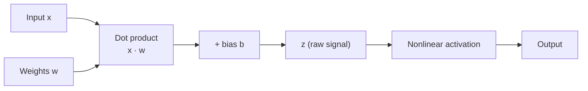
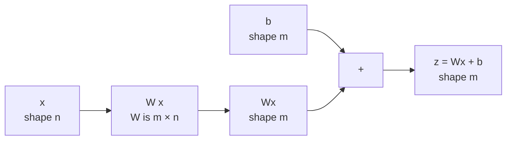

[Artificial Neural Networks](../../index.md) → Week 2: Mathematical Foundations for Neural Networks → Lesson 2: Linear Algebra for Neural Networks

---

# Linear Algebra for Neural Networks

## Key Concepts

### 1. Vectors, Matrices and the Dot Product

#### Vectors, matrices, tensors
Every input, weight, activation, output and gradient in a network is one of these.

| Object | What it is | Shape | Role in a network |
|---|---|---|---|
| **Vector** | Ordered list of numbers (column); 1st-order tensor | `x ∈ ℝⁿ`, shape `n × 1` | A data sample, a layer's activations, gradients |
| **Matrix** | 2-D grid of numbers; 2nd-order tensor | `W ∈ ℝ^(m×n)`, `m` rows, `n` columns | Weights connecting one layer to the next |
| **Tensor** | Generalisation to 3+ dimensions | e.g. height × width × channels | Images (3-D), video (4-D); deep learning frameworks work on tensors |

#### Shape consistency
- ★ Shapes must line up: a weight matrix `m × n` times an input of shape `n` gives an
  output of shape `m`.
- Mismatched shapes → the computation is invalid and fails in code. Most
  implementation bugs in neural networks are shape mismatches, so track the input,
  weight and output dimensions at every layer.

#### Dot product — algebraic view
- `x · w = Σ xᵢwᵢ` (i = 1..n): multiply matching elements and add them up.
- Always produces a **single scalar**, however many dimensions the vectors have.
- Example: `x = (2, 1, −1)`, `w = (3, −2, 4)` →
  `2·3 + 1·(−2) + (−1)·4 = 6 − 2 − 4 = 0`

#### Dot product — geometric view
- `x · w = ‖x‖ ‖w‖ cos θ`, where θ is the angle between the vectors, so cos θ measures
  how aligned they are.

| Angle | Direction | Dot product | Example |
|---|---|---|---|
| 0° | Same | Large, positive | `(2,2)·(3,3) = 12` |
| 180° | Opposite | Large, negative | `(2,2)·(−3,−3) = −12` |
| 90° | Perpendicular | Zero | `(1,0)·(0,1) = 0` |

#### Why the dot product matters
- ★ Every artificial neuron computes a dot product between its input vector and its
  weight vector — it measures **similarity / strength of evidence**.
- A bias is added: `z = x · w + b`. The dot product measures similarity; the bias shifts
  the point at which the neuron starts to activate.

---

### 2. Matrix Operations in Neural Networks

#### Why matrices
- One neuron = one dot product. A layer has many neurons working in parallel;
  computing them one by one would be very slow.
- Matrix notation computes **all neurons' dot products in one operation**.

#### A layer as a matrix multiplication
- With `m` neurons and `n` input features, stack each neuron's weight vector as a
  **row** of `W` (shape `m × n`).
- `z = W x` — row `i` of `W` dotted with `x` gives neuron `i`'s output `zᵢ = wᵢᵀ x`.
- Output `z` has one value per neuron (shape `m`).

- Worked example: `W` (3×2) = `[[1,0],[0,1],[1,1]]`, `x` = `(1, 2)`. Inner dimensions
  match (2 and 2), so `Wx = (1, 2, 3)`.

#### Bias as a vector
- In a full layer, the bias is a **vector** with one value per neuron:
  `b = (b₁, …, b_m)`.
- Full linear step: `z = Wx + b`. Each bias shifts its own neuron independently,
  giving every neuron its own baseline activation.

#### Batching
- Stack many input vectors as **columns** of a matrix `X`; one multiplication `WX`
  computes the outputs for the whole batch at once.
- ★ This is why GPUs and other parallel hardware suit deep learning so well.

#### Key takeaways
- One neuron → one dot product; one layer → one matrix multiplication; bias added as
  a vector.
- Vectors carry information, matrices connect layers, tensors generalise both.
