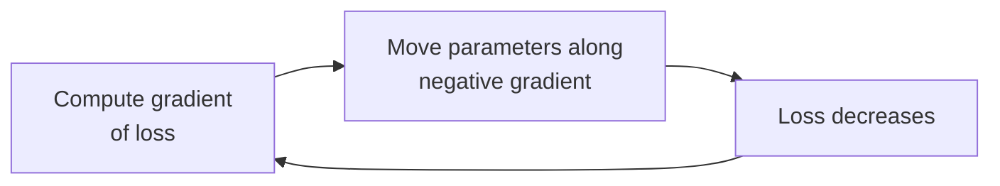
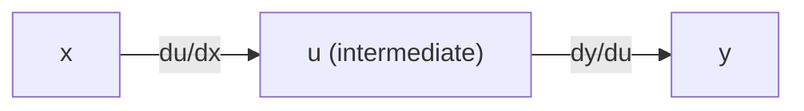

[Artificial Neural Networks](../../index.md) → Week 2: Mathematical Foundations for Neural Networks → Lesson 3: Calculus for Neural Networks

---

# Calculus for Neural Networks

## Key Concepts

### 1. Derivatives and Partial Derivatives

#### Why derivatives
- A network learns by adjusting its weights. To adjust them, we must know **how the
  output changes when a weight changes** — that sensitivity is the derivative.

#### Derivative
- Measures how fast the output `y` changes when the input `x` changes; geometrically,
  the **slope of the tangent line** at a point.
- In learning, the slope says whether increasing a parameter will raise the output,
  lower it, or barely matter.
- Example: `y = 5x`. At `x = 2`, `y = 10`; at `x = 2.001`, `y = 10.005`.
  Change in y / change in x = `0.005 / 0.001 = 5` → the slope is 5.

#### Partial derivative
- A network's output depends on many variables (inputs, weights, biases), so we need
  the effect of each one separately.
- `∂y/∂xᵢ` = how `y` changes when **only `xᵢ` changes** and all other variables are
  held fixed ("turn one knob at a time").
- Geometric view: slice the surface along one direction and take the slope of that
  slice. For `f(x, y) = x² + y²` with `y` fixed, the slice is a U-shaped curve `x²`;
  `∂f/∂x = 2x`, so at `x = 1` the tangent slope is 2.

---

### 2. Gradient Vector

#### Definition
- A single partial derivative isn't enough, so collect them all in one vector:

  `∇f = (∂f/∂x₁, ∂f/∂x₂, …, ∂f/∂xₙ)`

- It has the same dimension `n` as the input and tells us how sensitive the function
  is to every variable at once.

#### What it tells us
- ★ The gradient points in the direction of **steepest increase**; its magnitude is
  how fast the function rises that way.
- Large magnitude → changing rapidly. Near zero → locally flat.
- Gradient exactly 0 → **stationary point**: a minimum, maximum, or saddle point.

#### Worked example: `f(x, y) = x² + y²`
- `∂f/∂x = 2x`, `∂f/∂y = 2y` → `∇f = (2x, 2y)`.
- At `(1, 1)`: `∇f = (2, 2)`, the direction to move for the steepest climb.

#### Level curves
- A level curve joins all points where the function has the same value. For
  `x² + y²`, the points `(1,1)`, `(−1,1)`, `(1,−1)`, `(−1,−1)` all give `f = 2` and lie
  on one circle.
- ★ The gradient is always **perpendicular to the level curves**. Moving along a level
  curve doesn't change `f`; moving across curves along the gradient changes it fastest.

#### Role in training
- Training **minimises a loss function**, so we want the direction of steepest
  *decrease* = the **negative gradient**.
- Every learning algorithm, from plain gradient descent to advanced optimisers, uses
  the gradient to decide how to update parameters.

---

### 3. Chain Rule

#### Why it's needed
- Many systems are **compositions of simpler functions**: input → intermediate
  variable → output. The input affects the output only indirectly.
- Neural networks are deep compositions of simple functions, so the chain rule is the
  mathematical backbone of multilayer learning.

#### The rule

- `dy/dx = dy/du × du/dx` — sensitivity flows from `y` back through `u` to `x`.
- Simple case: `u = 3x`, `y = u²` → `dy/dx = 2u · 3`.

#### Two-layer example
`u = w₁x + b₁`, `y = u²` — `y` depends on `x`, `w₁` and `b₁` only through `u`.

| Sensitivity | Chain rule | Local derivatives | Result |
|---|---|---|---|
| `dy/dx` | `dy/du × du/dx` | `du/dx = w₁` | `2u · w₁` |
| `dy/dw₁` | `dy/du × du/dw₁` | `du/dw₁ = x` | `2u · x` |
| `dy/db₁` | `dy/du × du/db₁` | `du/db₁ = 1` | `2u` |

- `dy/du = 2u` in every row.
- ★ Each total derivative is a **product of local derivatives**, and this extends
  directly to much deeper networks.
