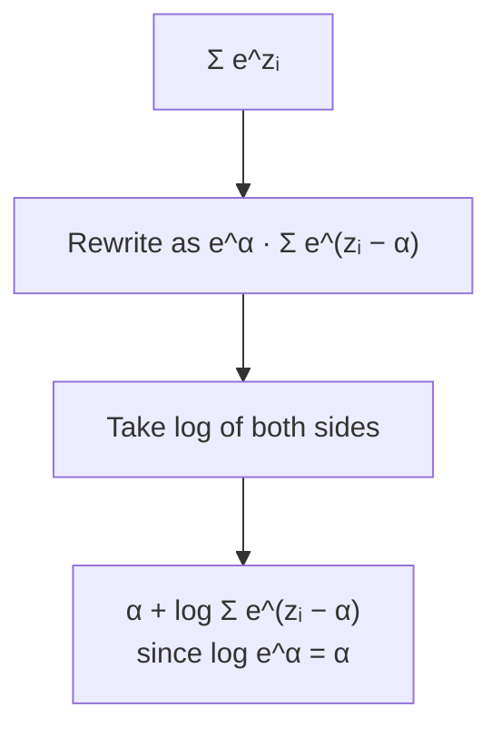

[Artificial Neural Networks](../../index.md) → Week 2: Mathematical Foundations for Neural Networks → Lesson 4: Numerical Stability in Training

---

# Numerical Stability in Training

## Key Concepts

### Why stability matters
- Computers use **finite numerical precision**, but deep learning relies on
  exponentials, long chains of multiplications, and very small probabilities — so
  instability is common.
- Failures are often **silent**: infinities, zeros or NaNs appear, gradients vanish or
  become undefined, and training may diverge or seem to converge while learning nothing.

### Overflow and underflow
| | Overflow | Underflow |
|---|---|---|
| What happens | Number too large to represent | Number so small it is rounded to exactly 0 |
| Example | `e¹⁰⁰⁰` → stored as infinity | `e⁻¹⁰⁰⁰` → stored as 0 |
| Consequence | Once ∞ appears, every later operation is meaningless | Gradient/probability information is permanently lost |

- Deep learning is especially exposed because of long multiplication chains,
  heavy use of exponentials, and tiny probabilities.

### The unstable expression: sum of exponentials
- `Σ e^(zᵢ)` appears inside probability computations.
- One large `zᵢ` can overflow it; all very negative `zᵢ` can underflow it to 0.

### Log-sum-exp trick
`log Σ e^(zᵢ) = α + log Σ e^(zᵢ − α)`, with `α = max(zᵢ)`

Derivation: factor `e^α` out of the sum.

- ★ Choosing `α` as the max: the largest term becomes `e⁰ = 1`, and all others fall
  between 0 and 1. Nothing overflows, and nothing underflows too fast.

### Other practical techniques
- Work in the **log domain**.
- **Subtract the maximum** before exponentiating.
- Add a small **epsilon** to denominators to avoid division by zero.
- Avoid directly multiplying long chains of probabilities.

### Key takeaway
- Stable numerics are a requirement, not an optional extra, for reliable deep learning.
