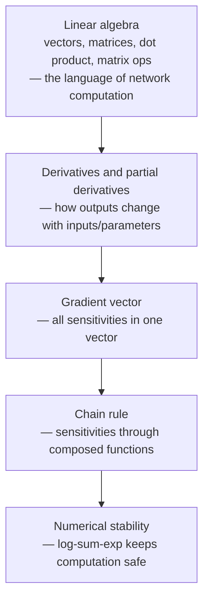

[Artificial Neural Networks](../../index.md) → Week 2: Mathematical Foundations for Neural Networks → Lesson 5: Module Summary

---

# Module Summary

## Key Concepts

### What this week built

- The focus was on maths (linear algebra, calculus, numerical computation), not yet on
  specific models.

### What's next
- Perceptron as a simple linear classifier
- Linear separability and the classic XOR limitation
- The logistic neuron
- These connect this week's maths to actual neural decision making and lead to
  multilayer networks.
