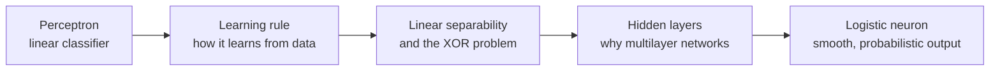

[Artificial Neural Networks](../../index.md) → Week 3: Perceptron and Logistic Neuron → Lesson 1: Introduction to the Perceptron and Logistic Neuron

---

# Introduction to the Perceptron and Logistic Neuron

## Key Concepts

### From mathematics to the first neural models
- Week 2 gave the maths (vectors, gradients, chain rule, numerical stability). This week
  applies it to the **first real decision-making units**: the perceptron and the
  logistic (sigmoid) neuron.

### Roadmap

- ★ Together these ideas explain **why multilayer networks are necessary**, and form the
  bridge to deeper architectures later.
