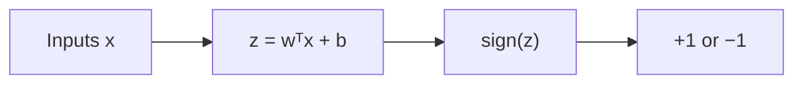
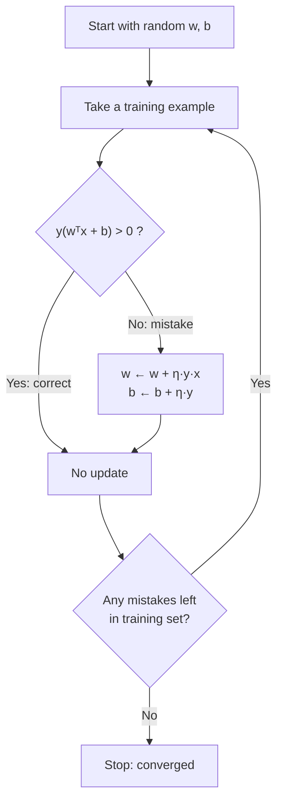

[Artificial Neural Networks](../../index.md) → Week 3: Perceptron and Logistic Neuron → Lesson 2: The Perceptron

---

# The Perceptron

## Key Concepts

### 1. Perceptron as a Simple Linear Classifier

#### Definition
- The simplest computational model of a neuron and the first true neural network model
  (Frank Rosenblatt, late 1950s). Purpose: **binary classification**.
- Computation:
    - `z = wᵀx + b` — weighted sum of inputs plus bias
    - `ŷ = sign(z)` — `+1` if `z > 0`, `−1` if `z < 0`

#### Linear classifier
- `wᵀx + b = 0` is a **line** in 2-D, a **plane** in 3-D, a **hyperplane** beyond that.
- It splits the input space into two **half-spaces**: one side is `+1`, the other `−1`.
- ★ So it can only classify **linearly separable** data — where one straight line or
  hyperplane separates the classes. If not (e.g. one class ringed by the other), no
  choice of weights and bias works.

---

### 2. Geometric Interpretation in 2D

#### The decision boundary
- In 2-D: `w₁x₁ + w₂x₂ + b = 0`, a straight line in the `x₁x₂` plane.
- Classification is a **sign test** — which side of the line the point is on. No
  distance, probability or confidence yet.
- Via the dot product: `wᵀx` measures alignment between input and weight vector;
  positive and large enough → `+1`.

#### Roles of weights and bias
| | Weights `w` | Bias `b` |
|---|---|---|
| Controls | **Orientation** of the boundary | **Position** of the boundary |
| Change it | Boundary **rotates** | Boundary **shifts parallel** to itself |

- `w` is the **normal vector** (perpendicular) to the boundary and points toward the
  `+1` region.

#### Worked example
`w = (1, 1)`, `b = 0` → boundary `x₁ + x₂ = 0`.
- `x = (2, 1)`: `2 + 1 = 3 > 0` → class `+1`
- `x = (−2, −1)`: `−2 − 1 = −3 < 0` → class `−1`

#### Geometric failure
- For some point layouts no line, however rotated or shifted, separates the classes.
  The perceptron fails there because of the **geometry of the problem**, not bad
  training.

---

### 3. Perceptron Learning Rule

#### Why a rule is needed
- The weights and bias aren't known in advance; the rule learns them from labelled
  examples `(xᵢ, yᵢ)`, with `yᵢ ∈ {+1, −1}`.

#### Mistake condition
- Correct if `yᵢ(wᵀxᵢ + b) > 0`; misclassified if `yᵢ(wᵀxᵢ + b) ≤ 0` (the lecture's
  "= 0" is the boundary case of this).
- ★ The rule is **mistake-driven**: it only updates on misclassified examples.

#### Update equations
- `w ← w + η · y · x`
- `b ← b + η · y`
- `η` = learning rate (positive), controls update size.

#### Why the update works
| Mistake | Update | Effect |
|---|---|---|
| Positive example (`y = +1`) predicted negative | **Adds** a multiple of `x` to `w` | More alignment between `x` and `w` → more likely `+1` next time |
| Negative example (`y = −1`) predicted positive | **Subtracts** a multiple of `x` from `w` | Less alignment → pushed toward `−1` |

- Each update slightly rotates/shifts the boundary until it fits the data.

#### Convergence and limitations
- ★ If the data is **linearly separable**, the rule is **guaranteed to converge** in a
  finite number of updates.
- If not separable, it **never converges** — weights keep updating forever.
- It does **not**: minimise a smooth loss, use gradients, or give probabilistic outputs.
  These gaps motivate the logistic neuron.
