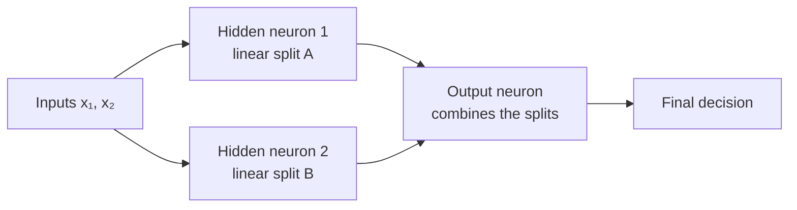

[Artificial Neural Networks](../../index.md) → Week 3: Perceptron and Logistic Neuron → Lesson 3: Linear Separability and XOR

---

# Linear Separability and XOR

## Key Concepts

### 1. Linear Separability and the XOR Limitation

#### Linear separability
- A dataset is **linearly separable** if some `w` and `b` satisfy
  `yᵢ(wᵀxᵢ + b) > 0` for **every** training example — all positives on one side, all
  negatives on the other.
- Boundary: a line in 2-D, a hyperplane in higher dimensions.

| | Linearly separable | Not linearly separable |
|---|---|---|
| Separating line | Exists (infinitely many possible) | None |
| Perceptron | Can classify perfectly; learning rule converges | Fails however long it trains or however it is initialised |

- ★ Success or failure of a perceptron is a **geometric property of the data**.

#### The XOR problem
- Output is positive when the two inputs **differ**, and 0 when they are the same.

| x₁ | x₂ | XOR |
|---|---|---|
| 0 | 0 | 0 |
| 0 | 1 | 1 |
| 1 | 0 | 1 |
| 1 | 1 | 0 |

- Plotted, the points of each class sit **diagonally opposite** each other, so no single
  line separates them.
- XOR is the simplest, clearest demonstration of a single-layer limit.

---

### 2. Multi-Layer Networks and XOR

#### The limitation is structural
- The failure isn't due to poor learning, bad initialisation, or too little data. One
  perceptron makes **one boundary → two regions**; XOR needs the space split into
  several regions.

#### How a hidden layer helps

- Each hidden neuron learns its **own linear separator**; the output neuron combines
  them into the final decision.
- For XOR: two lines are drawn; points **between** the lines are one class, points
  **outside** are the other.
- ★ Composing several linear cuts gives **nonlinear decision regions**. XOR needs at
  least one hidden layer.
- Multilayer networks are strictly **more expressive** than a single perceptron —
  greater expressive power, not just better learning rules, is why deeper networks win.
