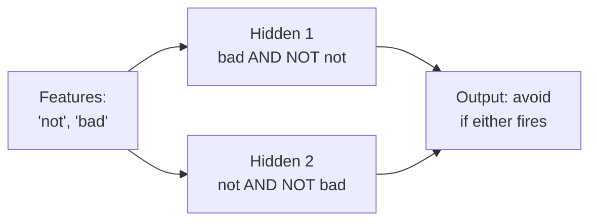
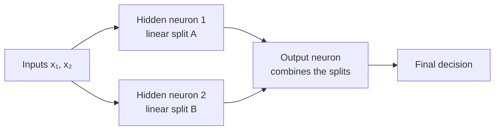

[Artificial Neural Networks](../../index.md) → Week 3: Perceptron and Logistic Neuron → Lesson 3: Linear Separability and XOR

---

# Linear Separability and XOR

## Key Concepts

### 1. Linear Separability and the XOR Limitation

#### Linear separability
- A dataset is **linearly separable** if some `w` and `b` satisfy
  `yᵢ(wᵀxᵢ + b) > 0` for **every** training example — all positives on one side, all
  negatives on the other.
- Boundary: a line in 2-D, a hyperplane in higher dimensions.
- Example of non-separable data: one class forming a circle with the other class in a
  concentric ring around it — no straight line can split them with good accuracy.

| | Linearly separable | Not linearly separable |
|---|---|---|
| Separating line | Exists (infinitely many possible) | None |
| Perceptron | Can classify perfectly; learning rule converges | Fails however long it trains or however it is initialised |

- ★ Success or failure of a perceptron is a **geometric property of the data**.
- On non-separable data the rule **oscillates**: fixing one point breaks another, so it
  never stops updating.

#### The XOR problem
- Output is positive when the two inputs **differ**, and 0 when they are the same.

| x₁ | x₂ | XOR |
|---|---|---|
| 0 | 0 | 0 |
| 0 | 1 | 1 |
| 1 | 0 | 1 |
| 1 | 1 | 0 |

- Plotted, the points of each class sit **diagonally opposite** each other, so no single
  line separates them.
- XOR is the simplest, clearest demonstration of a single-layer limit.
- It is a teaching example, not a real-world use case. Real data can show similar
  patterns but noisier, and you only learn the true shape of the data once models are
  fitted.

#### Real-world analogy: "good" vs "not bad"
- The same XOR structure appears in language. Predict the next word after
  *"The movie was ___, so I would ___"*:
    - `x₁` = 1 if the phrase contains **"not"**, else 0
    - `x₂` = 1 if the sentiment word is **"bad"** (0 for "good")
    - output = 1 if the next word is **"avoid"**, 0 if it is **"recommend"**

| Phrase | x₁ (not?) | x₂ (bad?) | Next word | Output |
|---|---|---|---|---|
| "good" | 0 | 0 | recommend | 0 |
| "bad" | 0 | 1 | avoid | 1 |
| "not good" | 1 | 0 | avoid | 1 |
| "not bad" | 1 | 1 | recommend | 0 |

- This is exactly the XOR table: the answer flips when **exactly one** of "not" / "bad"
  is present. Neither feature alone predicts the word; only their **combination** does.
- ★ A single perceptron (one line) fails here, just as on XOR. A hidden layer fixes it:
    - Hidden neuron 1 detects **"bad without not"** → avoid.
    - Hidden neuron 2 detects **"not without bad"** (i.e. "not good") → avoid.
    - Output neuron: **avoid if either fires**, otherwise recommend.

```mermaid
flowchart LR
    X["Features:<br/>'not', 'bad'"] --> H1["Hidden 1<br/>bad AND NOT not"]
    X --> H2["Hidden 2<br/>not AND NOT bad"]
    H1 --> O["Output: avoid<br/>if either fires"]
    H2 --> O
```

- **Link to LLMs:** predicting the next word is this same problem at scale. Language
  is full of feature combinations ("not good", "bank of a river" vs "bank account"), so
  LLMs need many hidden layers with nonlinear activations, not a single line. The
  output layer is a many-class version of the same decision (one score per word in the
  vocabulary, then softmax).

---

### 2. Multi-Layer Networks and XOR

#### The limitation is structural
- The failure isn't due to poor learning, bad initialisation, or too little data. One
  perceptron makes **one boundary → two regions**; XOR needs the space split into
  several regions.

#### How a hidden layer helps

```mermaid
flowchart LR
    X["Inputs x₁, x₂"] --> H1["Hidden neuron 1<br/>linear split A"]
    X --> H2["Hidden neuron 2<br/>linear split B"]
    H1 --> O["Output neuron<br/>combines the splits"]
    H2 --> O
    O --> Y["Final decision"]
```

- Two boundaries `D1` and `D2` = **two perceptrons** whose outputs are combined by a
  logical rule: outside `D1` or outside `D2` → class 0; **between** them → class 1.
- Each hidden neuron learns its **own linear separator**; the output neuron combines
  them into the final decision.
- For XOR: two lines are drawn; points **between** the lines are one class, points
  **outside** are the other.
- ★ Composing several linear cuts gives **nonlinear decision regions**. XOR needs at
  least one hidden layer.
- **How many layers?** Depends on the complexity of the data: linearly separable →
  one layer is enough; strongly non-linear (e.g. the circular data) → many hidden
  layers to reach a decent accuracy.
- Every neuron is still linear (`wᵀx + b`); a network layers many of these and joins
  them with a **nonlinear function** — non-linear behaviour is built from combined
  linear pieces.
- Multilayer networks are strictly **more expressive** than a single perceptron —
  greater expressive power, not just better learning rules, is why deeper networks win.
