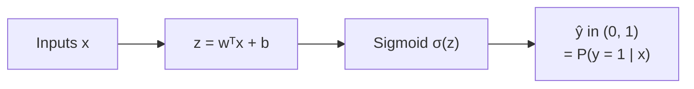

[Artificial Neural Networks](../../index.md) → Week 3: Perceptron and Logistic Neuron → Lesson 4: The Logistic Neuron

---

# The Logistic Neuron

## Key Concepts

### 1. Logistic Neuron and the Sigmoid

#### Problem with the hard threshold
- The perceptron's output jumps from `−1` to `+1`. This gives:
    - no notion of uncertainty
    - no probabilistic interpretation
    - difficulty with smooth, continuous optimisation

#### Sigmoid function
`σ(z) = 1 / (1 + e⁻ᶻ)`

| `z` | `σ(z)` |
|---|---|
| 0 | 0.5 |
| large positive | → 1 |
| large negative | → 0 |

- Smooth S-curve, no jumps; any real input maps strictly **between 0 and 1**.

#### The logistic neuron

- Same structure as the perceptron; **only the activation changes**.
- Output read as a probability: near 1 → confident class 1; near 0 → confident class 0;
  around 0.5 → uncertain. We get a **confidence score**, not just a label.
- ★ The decision boundary is still `ŷ = 0.5`, i.e. `wᵀx + b = 0` — **still linear**.

---

### 2. Perceptron vs Logistic Neuron

Both compute the same linear score `z = wᵀx + b`; they differ only after that.

| | Perceptron | Logistic neuron |
|---|---|---|
| Activation | Hard step / sign | Sigmoid |
| Output | `−1` or `+1` (label only) | Continuous value in (0, 1) |
| Interpretation | Class label, no confidence | Probability of class 1 |
| Near the boundary | Flips abruptly | ≈ 0.5 — expresses uncertainty |
| Decision boundary | `wᵀx + b = 0` (linear) | `wᵀx + b = 0` (linear) |
| Training | Non-differentiable step; no smooth optimisation | Differentiable → continuous optimisation possible |

- "Smooth decision boundary" does **not** mean a curved boundary — the boundary stays
  linear; what is smooth is the **transition of the output** across it.
- Why logistic is preferred in practice: rank predictions by confidence, adjust decision
  thresholds per application, reason quantitatively about uncertainty, and train with
  gradient-based methods.
- ★ It is the building block for modern multilayer networks.
