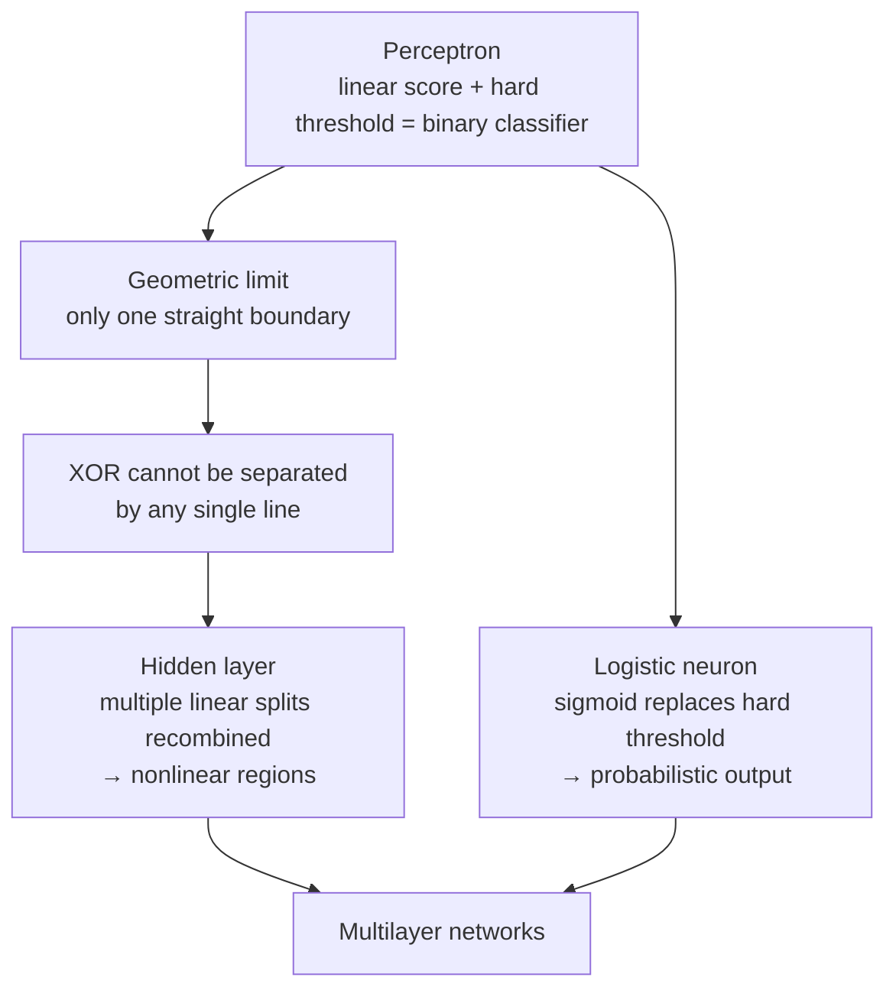

[Artificial Neural Networks](../../index.md) → Week 3: Perceptron and Logistic Neuron → Lesson 5: Module Summary

---

# Module Summary

## Key Concepts

### The big picture

- The perceptron works when data is linearly separable, a very restrictive assumption.
- The fix for XOR-type problems is a change of **architecture**, not just the neuron.

### What's next
- Architecture of multilayer perceptrons: hidden layers and forward paths
- Nonlinearity and activation functions
- Associated practical issues
