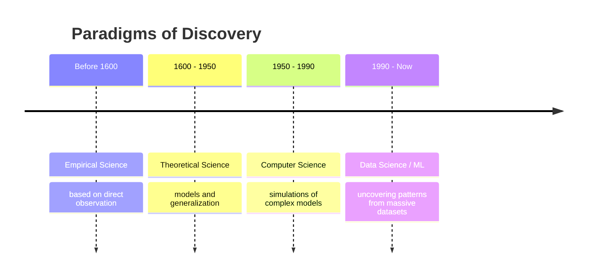
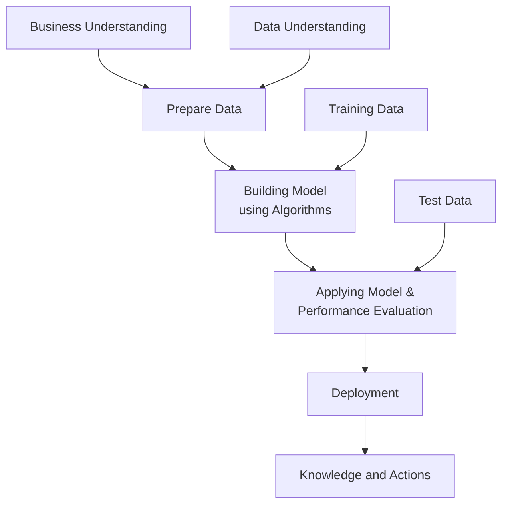
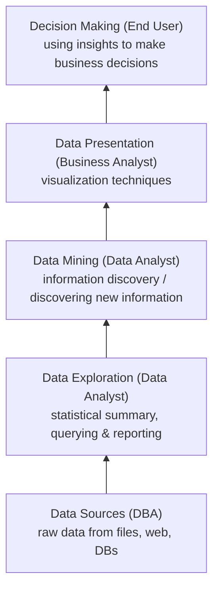
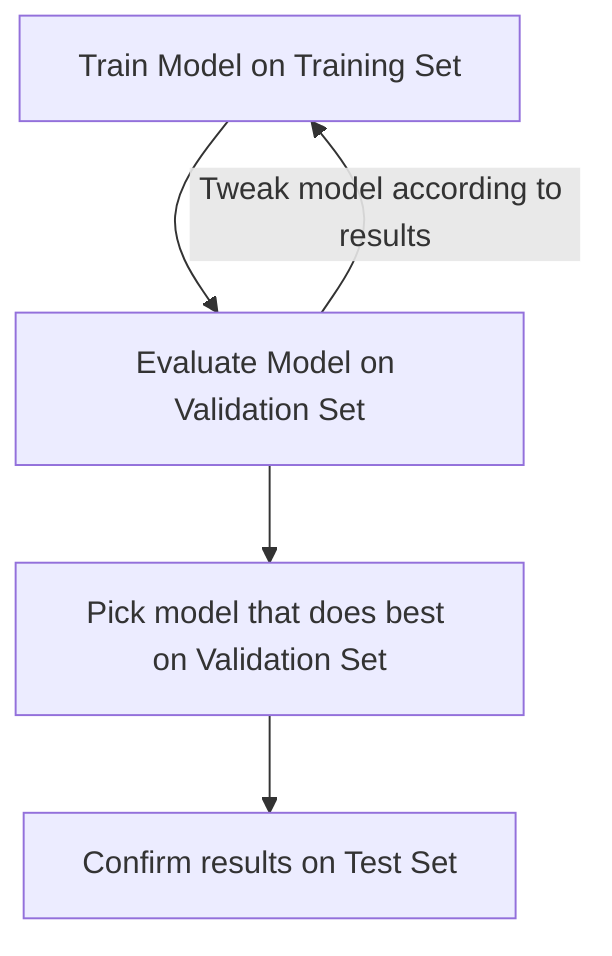

[Machine Learning](../index.md) → [Week 1: Introduction to Machine Learning](index.md) → Lesson 1: Machine Learning Paradigms and Workflow

# Machine Learning Paradigms and Workflow

## TL;DR
Machine Learning emerged because digitizing everyday physical experience generated
huge volumes of data, creating a need to extract patterns and knowledge from it. This
lecture traces that shift through four historical paradigms of discovery, defines ML,
and introduces two standard workflows for turning raw data into knowledge (KDD and
CRISP-DM), plus a business-intelligence view of the same journey. It then zooms into
**supervised learning** — learning from labelled data — covering its two flavors
(classification and regression) and the training/validation/test workflow used to
build and evaluate a model.

## Key Concepts

### Why Machine Learning emerged
- Physical, real-world experiences are increasingly captured as digital data (sensors,
  transactions, clicks, images, etc.).
- This digitization → massive volumes of generated data.
- Volume alone isn't useful — the value is in finding patterns and extracting
  knowledge from that data, which is what ML/data science does.

### The four paradigms of scientific discovery
Each era added a new way of generating knowledge, building on the previous one rather
than replacing it.

- **Empirical Science (before 1600):** knowledge from direct observation of the world.
- **Theoretical Science (1600-1950):** knowledge from models and generalizing
  observations into laws/theories.
- **Computer Science (1950-1990):** knowledge from running simulations of models too
  complex to solve analytically.
- **Data Science / Machine Learning (1990-now):** knowledge from uncovering patterns
  in massive, real-world datasets — often without a hand-built theoretical model first.

### Definition of Machine Learning
> The field of study that gives computers the ability to learn without being
> explicitly programmed.

- Contrast with classical programming: instead of hand-coding rules, the system infers
  rules/patterns from data.

### KDD (Knowledge Discovery in Databases)
The classic pipeline for going from raw data to actionable knowledge.

- Each stage narrows and refines the data until only task-relevant, validated patterns
  remain as "knowledge."
- **Data Mining** here is the pattern-extraction step, not the whole pipeline.

### CRISP-DM (Cross Industry Standard Process for Data Mining)
The most widely used industry framework for data mining/ML projects — organizes the
same idea as KDD around 5 phases.

| Phase | Stage(s) | What happens |
|---|---|---|
| 1. Prior Knowledge | Business Understanding, Data Understanding | Understand the problem and the data available before touching a model |
| 2. Preparation | Prepare Data | Clean/transform data into a usable form |
| 3. Modeling | Building Model using Algorithms | Train models using training data |
| 4. Application | Applying Model and Performance Evaluation | Evaluate the model against test data |
| 5. Knowledge | Deployment → Knowledge and Actions | Deploy the model and act on what it produces |

- Why it matters: gives teams a repeatable, industry-standard checklist so an ML
  project doesn't skip straight from data to model without understanding the business
  problem first.

### The Business Intelligence (BI) view
Same overall journey (data → decisions) but framed by *who* does each step and *how
much value* each layer adds — shown as a pyramid, increasing potential to support
business decisions as you go up.

- Why it matters: connects the technical pipeline (KDD/CRISP-DM) to organizational
  roles — a DBA, data analyst, business analyst, and end user each own a layer, and
  value/decision-support potential increases as data moves up the pyramid.

### Types of data used in ML
- **Structured** — fits a fixed schema (e.g. relational tables).
- **Unstructured** — no fixed schema (e.g. free text, images).
- **Time-variant data** — values change over time.

**Advanced/specialized data types:**
- **Data stream & sensor data** — continuous, high-velocity data from sensors/IoT.
- **Time series & sequence data** — ordered observations over time.
- **Spatial and spatio-temporal data** — location-based, e.g. GPS tracking data.
- **WWW (web) data** — data generated by/on the web.

### How machines learn: prediction vs. description
Two fundamental approaches to machine learning, split by whether the "correct answer"
is known in advance.

| | Prediction Methods (Supervised Learning) | Description Methods (Unsupervised Learning) |
|---|---|---|
| Goal | Predict an unknown value | Find interesting, human-interpretable patterns that describe the data |
| How | Learns from examples where the "correct answer" is already known | Explores the data on its own, without any "correct answers" |

### Supervised Learning
- **Definition:** learning from labelled data — each training example has a known
  correct answer, called a **class label**.
- Why it matters: this is the "prediction methods" branch above — the model's job is
  to generalize from labelled examples to predict the label/value of unseen data.
- Two types: **classification** (predicts a category) and **regression** (predicts a
  numerical value).

#### Classification
- Predicts a category/class from a **finite** set of possible values (e.g.
  rain/no rain, churn/no churn, news article category, dog vs. cat in an image).
- **Training set:** a set of attributes plus the class label/target to predict.
- **Goal:** predict the class for an unseen record (not part of the training set) as
  accurately as possible.
- Real-world examples: credit card fraud detection, direct marketing, churn detection
  (stay or leave the platform).
- **Evaluation metrics:** accuracy, precision.

#### Regression
- Predicts a **continuous** numerical value rather than a category (e.g. house price,
  petrol price, gold price, sales next year, stock price tomorrow, wind velocity and
  temperature).
- **Evaluation metric:** Mean Absolute Error (MAE).

### Training / Validation / Test workflow
How a supervised model is built and evaluated without "cheating" by testing on data
it was trained on.

- **Training set:** used to fit the model.
- **Validation set:** used to evaluate and tweak the model (e.g. choosing
  hyperparameters or comparing candidate models) without touching the test set.
- **Test set:** held out until the end, used once to confirm the chosen model's
  real-world performance.
- Why it matters: prevents overfitting to a single dataset — tweaking decisions happen
  on the validation set, so the test set gives an unbiased final performance estimate.

## Worked Examples
No worked numerical/algorithmic example in this lecture — it was conceptual/framework
introduction. Worked examples begin from the next lecture applying CRISP-DM/KDD, and
specific classification/regression algorithms, to actual datasets.

## Questions / Confusions
- [x] What's the difference between KDD and CRISP-DM? — Resolved: KDD is the more
  academic/general pipeline (Databases → ... → Knowledge); CRISP-DM is the industry
  standard, restating the same flow with explicit "Prior Knowledge" and "Business
  Understanding" phases up front, making it more project-management-friendly.
- [ ] How do the "advanced data types" (streams, spatio-temporal, WWW) map to specific
  ML techniques covered later in the course?
- [ ] How exactly is the validation set chosen/split from the training set in practice
  (e.g. k-fold cross-validation vs. a simple hold-out split)?

## Connections
- CRISP-DM's "Modeling" and "Application" phases are exactly where the
  training/validation/test workflow lives — training data feeds Modeling, test data
  feeds Application (see the CRISP-DM diagram above).
- Supervised learning (prediction methods) and unsupervised learning (description
  methods) are the two branches under "How machines learn" — this lecture covers the
  supervised branch in depth.

## Glossary
| Term | Definition |
|------|------------|
| KDD | Knowledge Discovery in Databases — pipeline from raw data to knowledge (Databases → Integration → Cleaning → Warehouse → Selection → Data Mining → Pattern Evaluation → Knowledge) |
| CRISP-DM | Cross Industry Standard Process for Data Mining — 5-phase industry-standard ML project framework (Prior Knowledge, Preparation, Modeling, Application, Knowledge) |
| Data Mining | The step of extracting patterns/information from prepared data |
| Structured data | Data with a fixed schema (e.g. tables) |
| Unstructured data | Data without a fixed schema (e.g. text, images) |
| Spatio-temporal data | Data with both location and time dimensions (e.g. GPS tracks) |
| Supervised learning | Learning from labelled data, where the correct answer (class label) is known during training |
| Class label | The known "correct answer" attached to a training example |
| Classification | Supervised learning task predicting a category from a finite set of classes |
| Regression | Supervised learning task predicting a continuous numerical value |
| Training set | Data used to fit/train the model |
| Validation set | Held-out data used to evaluate and tweak the model during development |
| Test set | Held-out data used once, at the end, to confirm final model performance |
| MAE (Mean Absolute Error) | Average of the absolute differences between predicted and actual values — a regression evaluation metric |
