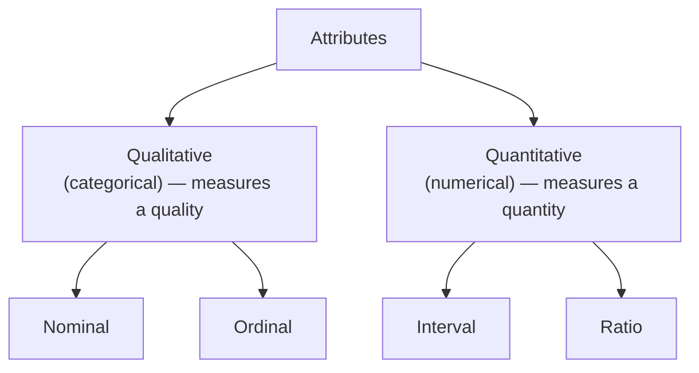
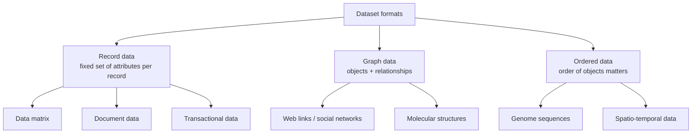
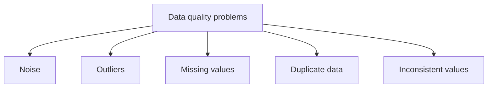
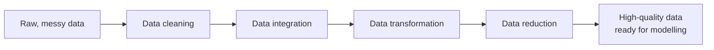
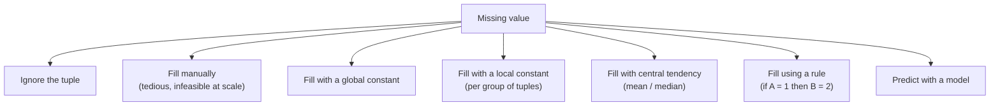
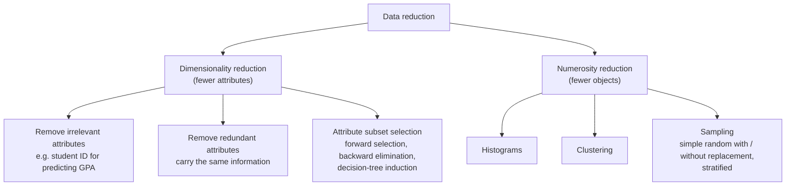

[Machine Learning](../index.md) → Week 2: Data Preprocessing → Lesson 1: Data Fundamentals and Preprocessing

---

# Data Fundamentals and Preprocessing

## Key Concepts

### 1. Data Objects, Attributes, and Types

#### Dataset, data objects, and attributes
- A **dataset** is a structured collection of data objects (e.g. a bank passbook: one row
  per transaction, with date, transaction ID, credit, debit, balance as columns).
- In a table, **rows** are data objects and **columns** are attributes.
    - **Data object** — also called record, point, case, sample, entity, instance, tuple.
    - **Attribute** — a property/characteristic of an object; also called feature,
      variable, field.
    - **Attribute value** — the specific number or symbol an attribute takes for one
      object (e.g. *Marital Status* has values Single / Married / Divorced).
- A collection of attribute values together describes one object.

#### Attribute types

| Type | Meaning | Examples | Operations that make sense |
|---|---|---|---|
| **Nominal** | Labels that only distinguish one value from another | ID number, eye colour, zip code | `=`, `≠` (distinctness) |
| **Ordinal** | Values can be ranked; distance between values has no meaning | Grades (A > B > C), rank, height as tall/medium/short | distinctness + order (`<`, `>`) |
| **Interval** | Differences are meaningful, fixed unit, **no true zero** | Calendar dates, temperature (°C) | distinctness, order, `+`, `−` |
| **Ratio** | Differences **and ratios** are meaningful, has a **true zero** | Length, time, count | all of the above + `×`, `÷` |

- Each type adds one more allowed operation on top of the previous one — ★ this decides
  which statistics/algorithms are valid for an attribute.
- Ratio makes sense because of the true zero: 10 km is twice 5 km. (20 °C is *not* twice
  10 °C, since 0 °C isn't "no temperature".)

#### Discrete vs continuous attributes
- **Discrete** — finite/countable set of values (zip code, binary 0/1 with cardinality 2).
- **Continuous** — infinitely many possible values (temperature: 10, 10.1, 10.11, ...).

---

### 2. Dataset Formats

#### Why structure matters
- ★ The structure of a dataset determines which questions you can ask and which analysis
  tools you can apply. Choosing the right representation is a critical early step.

#### Record data
- A collection of records, each with a fixed set of attributes (tabular data).
- Three special cases:
    - **Data matrix** — all attributes numerical, so each object is a point in
      multi-dimensional space.
    - **Document data** — each document is a *term vector*: every distinct term in the
      collection is an attribute, and the value is how often it appears (e.g. "team" 3
      times, "coach" 0 times). Results in a very **sparse** matrix.
    - **Transactional data** — each record is a *set of items* bought together (e.g.
      TID 1 → {bread, coke, milk}); attributes are not fixed per record.

#### Graph data
- Used when the **relationships between objects** matter more than their attributes.
- Web: nodes = pages, edges = hyperlinks. Analysing this graph powers Google's
  PageRank (shows pages in descending order of importance).
- Chemistry: nodes = atoms, edges = chemical bonds.

#### Ordered data
- Objects form a sequence where **order matters** (A, then B, then C...).
- Examples: genome sequences, transaction sequences; spatio-temporal data carries both
  location and time.

---

### 3. Data Quality Issues

#### Ideal vs real world
- Ideal assumption: data is perfect, complete, ready for modelling.
- Reality: raw data is **messy, incomplete, and inconsistent**.
- ★ **Garbage in, garbage out** — poor-quality data → poor-quality model, whether
  predictive or descriptive.

#### What is data quality?
- Data quality = the overall utility of a dataset for its **intended purpose**.
- Data has quality if it satisfies the requirements of the intended user — it is
  **subjective**. Same Amazon dataset can be good for an R&D manager (questions about
  product innovation) but poor for a delivery manager (questions about on-time delivery).
- Example: a credit-card fraud detector needs thousands of labelled transactions;
  without labels the data is poor quality for that purpose.

#### Dimensions of data quality
| Dimension | Question it asks | Example of failure |
|---|---|---|
| **Accuracy** | Is the data correct? | Customer name misspelled |
| **Completeness** | Is everything needed present? | Address field half-empty |
| **Consistency** | Does the data contradict itself? | Age doesn't match date of birth |
| **Timeliness** | Is it up to date? | Outdated current address |
| **Believability** | How much can we trust it? | — |
| **Interpretability** | Can people easily understand it? | — |

#### Common data quality problems

- **Noise** — random error/variance added to the true value (like static on a phone
  line). Causes: faulty sensors, transmission problems, data-entry mistakes (e.g. census
  forms digitised by hand, or wrong answers given deliberately).
- **Outliers** — ★ *legitimate* objects whose characteristics differ considerably from
  most of the data. **Noise is an error; an outlier is extreme but real.**
    - **As a nuisance:** distorts statistics. For `1, 2, 3, 4, 100` the mean is **22**;
      without the outlier it is **2.5**.
    - **As the goal:** the point of the analysis is to find them — credit-card fraud
      detection, network intrusion detection.
- **Missing values** — information not collected, attribute not applicable, or
  equipment malfunction.
- **Duplicate data** — duplicate/near-duplicate objects or attributes, typically after
  merging multiple sources.
- **Inconsistent values** — contradictions within or across records.

#### Data preprocessing as the solution
- Poor data → bad business decisions, reduced trust in the system, wasted time/resources.
- **Data preprocessing** = steps applied to raw data to prepare it for later analysis.
- Two goals:
    1. **Improve data quality** — handle noise, missing values, inconsistencies.
    2. **Make data fit the model** — structure it so the ML/mining algorithm works well.

---

### 4. Data Preprocessing Techniques

Preprocessing is a *set of tasks*, not a single action. Four major groups:

#### Data cleaning
Fixes the quality issues from the previous section.

**Handling missing values**

**Handling noisy data**
- **Binning** (local smoothing) — sort values, partition into equal-size bins, then
  replace each value in a bin with the bin's mean, median, or boundary value.
- **Regression** — fit a regression function; the fitted line represents the smoothed
  data.
- **Outlier analysis** — cluster the data; points falling outside the clusters are
  potential noise, to be handled separately.

#### Data integration
- Merging data from multiple sources — must be done carefully.
- Typical problems:
    - **Entity identification** — matching the same attribute/entity across sources.
    - **Data value conflicts** — same person recorded as "John Smith" in one table and
      "J.D. Smith" in another.
    - **Redundancy** — blind merging duplicates attributes/tuples.
- Example: India's voter ID, passport, driving licence, etc. were considered for merging
  into one master table to identify every citizen uniquely. Entity-identification,
  value-conflict and redundancy issues made it impractical, so Aadhaar was built from
  scratch instead. ★ Integration is tedious and time-consuming.

#### Data transformation
- Changes the **scale and structure** of data to suit the algorithm — it is not about
  fixing errors.

**Normalisation** — stops attributes with large magnitudes from dominating
distance-based calculations (e.g. income in lakhs swamps age 1–100 in Euclidean
distance) and speeds up training.

| | Min-max normalisation | Z-score normalisation |
|---|---|---|
| Based on | minimum and maximum | mean and standard deviation |
| Result | values mapped linearly to a new range | values centred on 0, in units of std dev |
| Formula | `v' = (v − min) / (max − min) × (new_max − new_min) + new_min` | `v' = (v − mean) / std_dev` |

**Aggregation** — roll data up to a coarser level (city → state → country, quarterly →
yearly). Reduces data volume, changes scale, and gives more stable data with less
variability.

#### Data reduction
- Goal: a much smaller representation that keeps the **integrity** of the original, so
  model building is faster and feasible.
- Reduce columns, rows, or both.

- **Forward selection** — start with an empty attribute set, add attributes one at a
  time, tracking performance; keep the best subset. **Backward elimination** works the
  other way, starting from all attributes.
- **Sampling** — use a representative sample that behaves almost like the full dataset.
